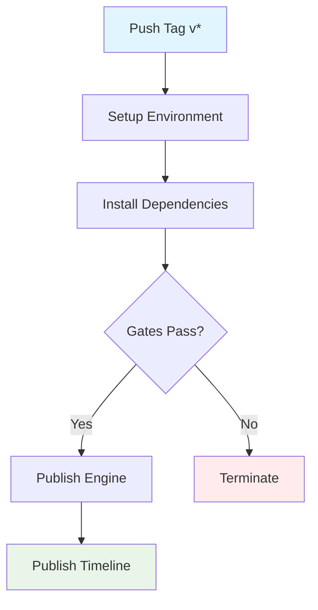

## Workflow Overview

**Purpose**: Automate the publishing of the React Timeline Editor workspace packages to npm.
**Trigger Events**: Pushing a git tag that matches `v*` (e.g. `v1.0.2`).
**Target Environments**: NPM public registry.

## Execution Flow Diagram



## Jobs & Dependencies

| Job Name    | Purpose                                      | Dependencies | Execution Context |
| ----------- | -------------------------------------------- | ------------ | ----------------- |
| publish-npm | Build, lint, and publish the packages to npm | None         | Ubuntu Latest     |

## Requirements Matrix

### Functional Requirements

| ID      | Requirement      | Priority | Acceptance Criteria                            |
| ------- | ---------------- | -------- | ---------------------------------------------- |
| REQ-001 | Auto-Publish     | High     | Tag pushed -> Packages live on NPM             |
| REQ-002 | Monorepo Support | High     | Both `timeline` and `engine` must be published |

### Security Requirements

| ID      | Requirement | Implementation Constraint          |
| ------- | ----------- | ---------------------------------- |
| SEC-001 | Secure Auth | Use GitHub Secrets for `NPM_TOKEN` |

### Performance Requirements

| ID       | Metric          | Target      | Measurement Method   |
| -------- | --------------- | ----------- | -------------------- |
| PERF-001 | Publishing Time | < 2 minutes | Actions duration log |

## Input/Output Contracts

### Inputs

```yaml
# Environment Variables
NODE_AUTH_TOKEN: secret # Purpose: Authentication for npm registry

# Repository Triggers
tags:
  - 'v*'
```

### Outputs

```yaml
# Job Outputs
# None explicitly returned. External state change occurs on npm registry.
```

### Secrets & Variables

| Type   | Name      | Purpose               | Scope      |
| ------ | --------- | --------------------- | ---------- |
| Secret | NPM_TOKEN | Authentication to npm | Repository |

## Execution Constraints

### Runtime Constraints

- **Timeout**: Default GitHub Actions timeout
- **Concurrency**: Grouped logic to prevent overlapping publishes if triggered quickly.
- **Resource Limits**: Standard runner limits.

### Environmental Constraints

- **Runner Requirements**: `ubuntu-latest`
- **Network Access**: Needs access to npm registry.
- **Permissions**: Read contents.

## Error Handling Strategy

| Error Type    | Response      | Recovery Action           |
| ------------- | ------------- | ------------------------- |
| Build Failure | Fail workflow | Fix code and retag/repush |
| Auth Failure  | Fail workflow | Check NPM_TOKEN validity  |

## Quality Gates

### Gate Definitions

| Gate          | Criteria               | Bypass Conditions |
| ------------- | ---------------------- | ----------------- |
| Code Quality  | `bun run lint` passes  | None              |
| Build Quality | `bun run build` passes | None              |

## Monitoring & Observability

### Key Metrics

- **Success Rate**: 100% on valid code.
- **Execution Time**: Under 2 mins.

### Alerting

| Condition     | Severity | Notification Target   |
| ------------- | -------- | --------------------- |
| Workflow Fail | High     | Repo Owner via GitHub |

## Integration Points

### External Systems

| System       | Integration Type | Data Exchange          | SLA Requirements  |
| ------------ | ---------------- | ---------------------- | ----------------- |
| NPM Registry | REST             | Package tarball upload | High Availability |

## Compliance & Governance

### Security Controls

- **Secret Management**: NPM Token managed in GitHub UI. Tokens should be rotated periodically.
